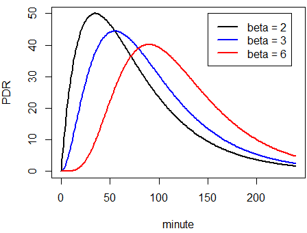

In the _Details_ panel, the per-curve fit results are displayed. To perfom your own statistical analysis, use the data downloaded as _Excel_ file.    

By default, the Search box in the top right corner contains the text `t50` which filters the table to show values for gastric emptying half-time only, computed by different methods. If you want to further restrict the table to show only `t50` computed by the Maes/Ghoos method, use the drop-down filter box in column `method`.

* To sort by the values in one column, click the up/down arrows.
* To download or print selected parameter table, use the buttons in the top-right corner.
* To display all parameters clear the text in Search box.

## Primary fit parameters
Each curve has 3 primary fit parameter for the exponentional beta function marked by method `exp_beta`.

* __m__: Effectively metabolized fraction of 13C as percentage, computed from the area under the PDF curve from 0 to infinity. This parameter depends on body weight and height, and may be badly defined if these are not given. Since some of the assumptions on metabolics are not well defined, it is rarely interpreted. The half-emptying time does not depend on `m`, but only on `beta` and `k`. 
* __k__: Time constant of the beta-exponential in units of 1/min; 1/k is sometimes quoted as the emptying time tempt. Both k and tempt are rarely interpreted directly, because the derived quantities `t50` and `tlag` are easier to interpret.
* __beta__: A dimensionless quantity, typically in the range from 1 to 3. Primarily,  (beta-1) is the degree of polynomial at minute = 0. For `beta = 2`, the function starts with a linear slope, for `beta = 3` like quadratic parabola with slope = 0. For higher values of `beta`, this results in a lag-like behaviour, most pronounced in the peak position that shifts to higher values.  

* __deviance__: Deviance quantifies goodness of fit, i.e. the deviation of the measured data points from the fit; smaller values indicate better fit. By sorting for deviance outlier curves can be identified.

## Derived parameters

The most important derived parameter is the half-emptying time `t50`. It can be computed from the primary fit parameters by different `methods`; see the [documentation](https://dmenne.github.io/breathtestcore/) for references. 

* __maes_ghoos__ The classical method by Maes/Ghoos (often called Ghoos-method); compared to half-emptying time from MRI or scintigraphy, the values of `t50` are much to high.
* __maes_ghoos_scint__ The Maes/Ghoos half-emptying time, with a linear correction so that emptying times are closer to those from MRI or scintigraphy. This is a purely ad-hoc correction that might work for some special meal, but demonstrates one of the heroic attempts to obtain realistic estimates for a method that does only badly reflect real gastric processing.
* __bluck_coward__ A version proposed by  Bluck and Coward to correct the estimated half emptying times. While the theory is has a sound pharmcological ba

A second parameter often used to describe the lag in gastric emptying is `tlag`, in the same method variants as for `t50`. 
* __maes_ghoos__ `tlag` is given as the position of the peak of the PDR time series. It is  indirectly related to a real lag in gastric emptying, which would be represented by a time shift without deformation, but it is a reasonable surrogate.
* __bluck_coward__ This estimate is not very useful, it can be negative.

## Where is the Wagner-Nelson method?

The Wagner-Nelson method is semi-parametric fit that seeminingly does not require a fit, so it was used for PDR time series that could not be fitted with the single-fit method. The approach is valid for the rising slope of the PDR curve, but it uses a fixed value for the trailing part of the curve which has little basis. In the legacy package [d13cbreath](https://github.com/dmenne/d13cbreath) I have implemented a method to replace the fixed estimate for the trailing slope by a fit, but I do not recommend the method any longer.

The Wagner-Nelson method was introduced because single curve fits as implemented (and not recommended) in this package often fails, and omitting these curves from studies introduces a heavy bias. The recommended method for studies should use an hierarchical fit as implemented by the `nlme` or Bayesian methods; the latter also works for single records. Do not use the Wagner-Nelson method, it does not give 'better' values, and the problems of using ^13^C PDR time serias as gastric emptying surrogates are much more basic. 

Sanaka, Yamamoto, Tsutsumi, Abe, Kuyama (2005) Wagner-Nelson method for analysing the atypical double-peaked excretion curve in the [13c]-octanoate gastric emptying breath test in humans. Clinical and experimental pharmacology and physiology 32, 590-594.  

