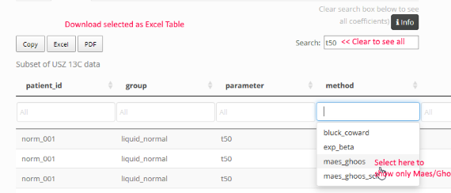

Package [breathtestshiny](https://github.com/dmenne/breathtestshiny) provides a web-based application for the functions in the R package [breathtestcore]](https://dmenne.github.io/breathtestcore/) to analyze ^13^C breath test data. To test some of the functions with sample data or your own data, try the [online demo](https://apps.menne-biomed.de/breathtestshiny). If you do not have a configured R installation available, the easiest path to run the web app on your own computer is via the [Docker package](https://hub.docker.com/r/dmenne/breathtestshiny/).

## The Details panel

In the *Details* panel, the per-curve fit results are displayed. To perform your own statistical analysis, you can download or print the data presented in the table.



By default, the Search box in the top right corner contains the text `t50` which filters the table to show values for gastric emptying half-time only, computed by different methods. If you want to further restrict the table to show only `t50` computed by the Maes/Ghoos method, use the drop-down filter box in column `method`.

-   To sort by the values in one column, click the up/down arrows.
-   To download or print selected parameter table, use the buttons in the top-right corner.
-   To display all parameters clear the text in Search box.

### Primary fit parameters

Each curve has 3 primary fit parameter for the exponential beta function marked by method `exp_beta`.

-   **m**: Effectively metabolized fraction of <sup>13</sup>C as percentage, computed from the area under the PDF curve from 0 to infinity. This parameter depends on body weight and height, and may be badly defined if these are not given. Since some of the assumptions on metabolics are not well defined, it is rarely interpreted. The half-emptying time does not depend on `m`, but only on `beta` and `k`.
-   **k**: Time constant of the beta-exponential in units of 1/min; 1/k is sometimes quoted as the emptying time t<sub>empt</sub>. Both k and t<sub>empt</sub> are rarely interpreted directly, because the derived quantities `t50` and `tlag` are easier to interpret.
-   **beta**: A dimensionless quantity, typically in the range from 1 to 3. Primarily, (beta-1) is the degree of polynomial at minute = 0. For `beta = 2`, the function starts with a linear slope, for `beta = 3` like quadratic parabola with slope = 0. For higher values of `beta`, this results in a lag-like behavior, most pronounced in the peak position that shifts to higher values.

```{r, fig.width= 4, fig.height=3, fig.cap="The beta exponential fit function with `m=50`, k = 0.03, and different values of beta.", echo = FALSE}
library(breathtestcore)
minute = 0:200
k = 0.02
y = exp_beta(minute, dose = 100, m = 50, beta = 1.5, k = k)
par(mar = c(4, 4, 0.5, 0) + 0.1)
plot(minute, y, type = "l", ylab = "PDR", lwd = 2)
y = exp_beta(minute, dose = 100, m = 50, beta = 3, k = k )
lines(minute, y, col = "blue", lwd = 2)
y = exp_beta(minute, dose = 100, m = 50, beta = 6, k = k)
lines(minute, y, col = "red", lwd = 2)
legend(100, 60, c("beta = 1.5", "beta = 3.0", "beta = 6.0"), col = c("black", "blue", "red"),
       lty = c(1,1,1), lwd = 2, bty = "n", cex = 0.8)
```

-   **deviance**: Deviance quantifies goodness of fit, i.e. the deviation of the measured data points from the fit; smaller values indicate better fit. By sorting for deviance outlier curves can be identified.

### Derived parameters

The most important derived parameter is the half-emptying time `t50`. It can be computed from the primary fit parameters by different `methods`; see the [documentation](https://dmenne.github.io/breathtestcore/) for references.

-   **maes_ghoos** The classical method by Maes/Ghoos (often called Ghoos-method); compared to half-emptying time from MRI or scintigraphy, the values of `t50` are much to high.
-   **maes_ghoos_scint** The Maes/Ghoos half-emptying time, with a linear correction so that emptying times are closer to those from MRI or scintigraphy. This is a purely ad-hoc correction that might work for some special meal, but demonstrates one of the heroic attempts to obtain realistic estimates for a method that does only badly reflect real gastric processing.
-   **bluck_coward** A version proposed by Bluck and Coward to correct the estimated half emptying times. While the theory has a sound pharmacological foundation, there is no clear evidence that it gives better validated estimates of gastric emptying.

A second parameter often used to describe the lag in gastric emptying is `tlag`, in the same method variants as for `t50`. \* **maes_ghoos** `tlag` is given as the position of the peak of the PDR time series. A real lag would show as a time shift without deformation of the curve, and `t_lag` is a reasonable surrogate . \* **bluck_coward** This estimate is not very useful, it can be negative.

### Where is the Wagner-Nelson method?

The Wagner-Nelson method is semi-parametric and apparently does not require a functional fit, so it was used for PDR time series that could not be fitted with the single-fit method. The approach is valid for the rising slope of the PDR curve, but it uses a fixed value to quantify clearance which does not reflect the large degree of variance between subjects.

*Sanaka, Yamamoto, Tsutsumi, Abe, Kuyama* **(2005)** Wagner-Nelson method for analyzing the atypical double-peaked excretion curve in the [13c]-octanoate gastric emptying breath test in humans. Clinical and experimental pharmacology and physiology 32, 590-594

In the legacy package [d13cbreath](https://github.com/dmenne/d13cbreath) I had implemented a method to replace the fixed estimate for the trailing slope by a fit, but I do not recommend the method any longer.

The Wagner-Nelson method was originally introduced for complex meals with double-peaked excretion curves. These cannot be handled successfully by the exponential-beta model, but giving a single value for the half-emptying time and for lags is anyway questionable in this case. A mixture model would be appropriate for multi-peaked data; in case you can provide example PDR time series, please contact the author of the package.

The Wagner-Nelson method has also been used because individual curve fits using nonlinear fit functions such as `nls` often fail, and omitting these failed fits from studies introduces a bias. The recommended method for clinical studies uses a hierarchical model as implemented by the `nlme` or Bayesian methods; the latter also works for single records.
